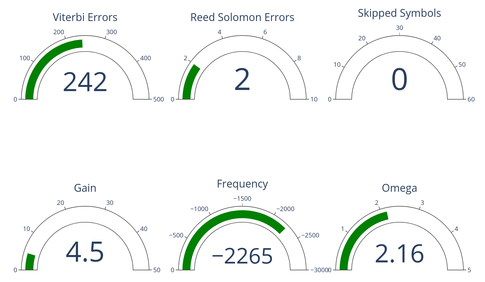
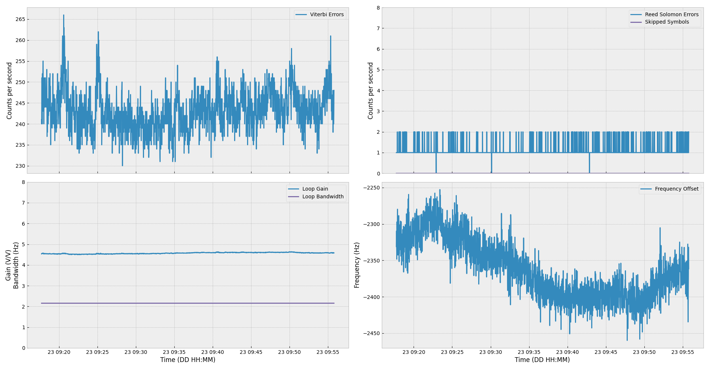

# goestools monitor written in python



# Dependencies:
A working installation of GOESTOOLS: https://github.com/pietern/goestools

Python bindings for nanomsg: https://github.com/nanomsg/nnpy

Both plotly and dash packages: https://plotly.com/

matplotlib https://matplotlib.org/

something like ```sudo apt install libnanomsg-dev``` and then ```sudo pip3 install python3 nnpy plotly dash matplotlib``` will install the dependencies on a Debian/Ubuntu based system.

